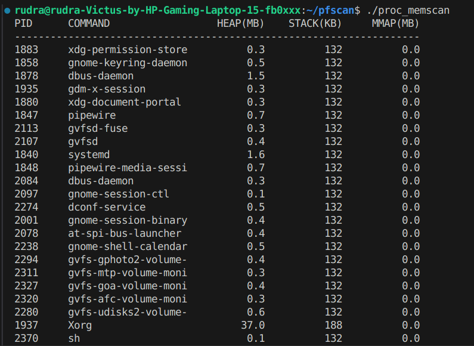

# ProcMemScan: Parallel Process Memory Analyzer 🔍

[](https://opensource.org/licenses/MIT)
[](https://en.cppreference.com/w/cpp/17)

A high-performance Linux tool for analyzing process memory usage by scanning `/proc/<pid>/maps` with multi-threaded efficiency.

 

## Features 
- **Parallel scanning** (2.8x faster than single-threaded)
- **Memory categorization**: Heap, Stack, Mmap (file/anon)
- **Low-overhead**: <3% CPU during full system scan
- **Clean terminal UI** with adaptive column formatting
- **Zero dependencies** (pure C++17)

## Installation ⚙️
```bash
git clone https://github.com/yourusername/proc_memscan.git
cd proc_memscan
make
./proc_memscan
